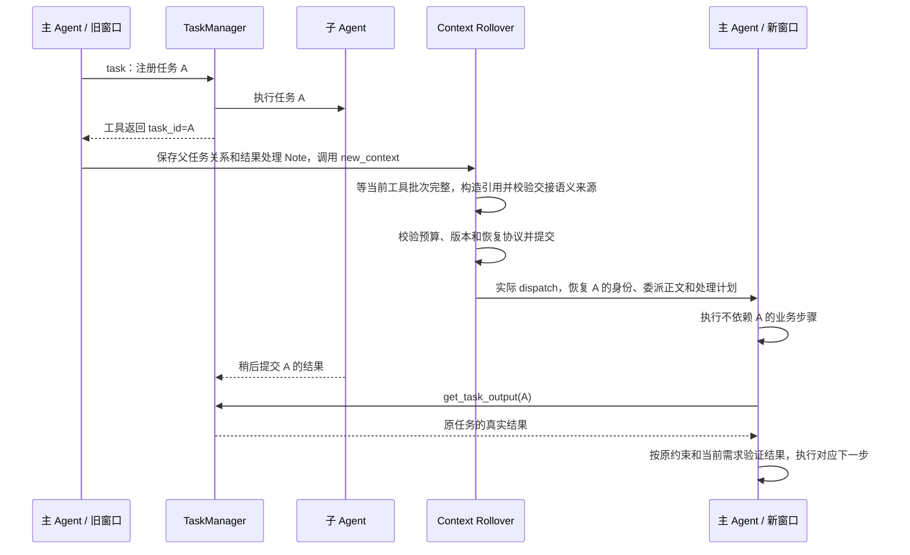

# 子 Agent 跨上下文窗口执行 Spec

> 历史规范（2026-09）：其中的 worker、task、TaskManager 子任务、自动监督续跑和期限规则已被同进程常驻子会话替代。当前契约见 [Subagents](../subagents.md)，本文件及下列旧验收只保留历史依据，不能用来证明当前实现已覆盖相同场景。

| 项目 | 内容 |
| --- | --- |
| 状态 | 跨窗功能原验收已完成；当前执行与通知协议已按超时监督规范更新，本轮验证另见监督实施报告 |
| 日期 | 2026-09-26 |
| 适用范围 | `packages/coding-agent` 的子任务交接、Context Rollover、print/json 运行生命周期 |
| 目标 | 已返回任务 ID 的子 Agent 即使仍在运行或取消中，也不再因等待其终态而阻止主 Agent 换窗 |
| 本轮交付 | 交接协议、统一门禁、请求正文覆盖、print/json 续跑、相关回归与[实施评估报告](subagent-context-rollover-implementation-report.md) |

用户已确认实施。相关代码改造、定向自动验证与本文要求的真实主/子 Agent 场景验收已完成。实现范围、成功证据、此前失败尝试与适用限制见实施评估报告。

上述验收描述的是原跨窗改造。当前协议同时遵守[超时监督规范](subagent-timeout-supervision.md)：同一宿主 Session 管理独立 worker，有限监督授权允许父任务续跑。当前改动的验证见[监督实施报告](subagent-timeout-supervision-implementation-report.md)，不能用原验收代替。

## 1. 问题与决策

后台委派包含两个不同生命周期：

1. `task` 工具调用：注册子任务并返回 `task_id` 后，这次调用已经结束。
2. 子任务执行：在独立子会话中继续运行，最终通过 TaskManager 记录结果。

目前换窗同时要求主工具批次完整和所有 Task 进入终态。第二个条件使不返回的子任务长期阻挡主 Agent 换窗，虽然其委派工具早已返回。

**决策：换窗等待父会话工具批次完整，不等待已完成交接的子 Agent 进入终态。子任务继续归原 AgentSession 的 TaskManager 管理；新窗口必须恢复任务身份、委派语义和父任务的处理计划，再按原任务 ID 查询及使用结果。**

仅恢复 taskId 不足以完成交接：模型可能知道某个任务存在，却不知道为什么委派、结果受哪些约束、回来后应该做什么。运行时必须保证这些材料实际进入新窗口请求；模型能否正确使用材料，还须通过实际 Agent 行为验收。

这是修改换窗语义与交接协议，不是给等待增加短超时，也不是增加自动终止策略。

改造前行为与实施依据：

| 位置 | 当前行为 | 本次意义 |
| --- | --- | --- |
| [task.ts](../../src/core/tools/task.ts) | 后台立即返回 ID；前台最多等待 600 秒，超时返回原 ID | 工具返回与任务结束可以分离 |
| [agent-session.ts](../../src/core/agent-session.ts) 的 ContextRollover `isBusy` 与 `_scheduleDeferredContextTransition` | `running/cancelling` Task 阻止提交及恢复换窗 | 两处门禁必须一致修改 |
| [context-rollover.ts](../../src/core/context-rollover.ts) | 保留完整工具事务、恢复覆盖、预算、版本比较和 dispatch 校验 | 这些正确性要求继续保留 |
| [print-mode.ts](../../src/modes/print-mode.ts) | `context_transition` 后对 active Tasks 执行 `awaitSettled` | 命令行存在另一条等待链，不能遗漏 |
| [pi-child-runner.ts](../../src/core/subagents/pi-child-runner.ts) | 子 Agent 使用独立 Agent 与内存 SessionManager | 主窗口变更无需重建子会话 |
| [context-rollover.md](./context-rollover.md) 的 R21、TG11、并发规则 | 明确要求 running/cancelling Task 先到终态 | 实施时同步修订相关约束和旧断言 |

## 2. 范围与完成含义

### 2.1 本次范围

- 同一宿主、同一 AgentSession、同一分支内的上下文换窗；子 Agent 在受监督独立 worker 中执行。
- 内置 `task` 工具创建的 `kind=subagent` 任务。
- 后台委派，以及前台等待超时后已经返回任务 ID 的子任务。
- 运行中、取消中、已完成但尚未读取结果的任务引用。
- interactive、SDK、RPC 的共享 Session 行为，以及 print/json 独立的退出等待行为。

本次只解除具备可验证交接引用的子 Agent 终态门禁。`bash`、`diagnostics`、`lsp` 等其他 Task 的既有换窗规则不扩展修改。不能把这个实现宣称为所有后台任务均可跨窗。

### 2.2 完成判断不能混用

| 对象 | 完成判断 |
| --- | --- |
| 委派工具调用 | 父会话对应 tool call 已有 tool result，且当前工具批次完整 |
| 子任务执行 | TaskManager 的真实状态进入 `completed/blocked/failed/cancelled`；`cancelling` 不是终态，查询超时也不是终态 |
| 换窗 | continuation 已校验、提交、实际 dispatch；恢复要求进入真实模型请求，主 Agent 可以执行新窗口业务动作 |
| 用户业务任务 | 原需求及其依赖已处理，有相应结果或明确阻塞说明；换窗成功、任务 ID 可读均不证明业务完成 |

本次不增加主任务完成判定器，不因换窗自动完成 Todo，也不因子任务终态自动宣称主任务完成。

## 3. 必须保持的不变量

| ID | 不变量 |
| --- | --- |
| S01 | 换窗不得切开父会话工具批次；`task` 未返回时不能提前合成成功 tool result |
| S02 | 已交接子任务保留原 taskId、TaskManager 实例、子会话、执行配置、工作目录与取消信号 |
| S03 | 换窗不调用 spawn、resume_from、cancelAll、dispose 来迁移子任务 |
| S04 | 任务引用由运行时从真实委派记录构造，模型不能靠省略 Note 将任务从交接清单中移除 |
| S05 | 交接任务引用是稳定身份；实时状态和结果以 TaskManager 为准，不持久化一个会被误当成当前状态的 `running` 快照 |
| S06 | 换窗前、准备中、提交后、恢复中完成的子任务均可用原 ID 查询；不重写原委派工具返回值 |
| S07 | TaskManager 的终态只说明执行状态，不证明结果已经被模型阅读、采用或验证 |
| S08 | 原任务的 ownerSessionId/rootPromptId 不因父窗口改变而重绑；不能依赖可缺省的 rootPromptId 判断分支归属 |
| S09 | 交接材料计入真实请求预算与恢复覆盖；分页不能静默丢弃引用 |
| S10 | 用户取消、待确认交互、工具事务、请求预算、恢复来源、版本比较、dispatch journal 等门禁继续有效 |
| S11 | 只有仍有效的一次性监督授权可续跑原父任务；普通完成没有无条件唤醒权，不自动重试或重复执行业务动作 |
| S12 | print/json 不得在换窗与续跑的间隙提前 dispose，也不得为了完成换窗等待已交接子任务终态 |
| S13 | 当前需交接任务的原委派正文、父任务关系和结果处理步骤必须进入恢复后的实际 provider request；ID、短描述、来源链接或读过某工具均不能替代正文覆盖 |
| S14 | 历史引用清单不等于当前待办清单；不因任务已终态就删除其待处理关系，也不因保留历史引用就重新执行已处理任务 |
| S15 | 运行时保证身份、来源、必要材料与请求覆盖，不声称能证明模型理解正确；实际 Agent 必须按委派约束验证结果并完成正确后续动作 |

## 4. 任务交接协议

### 4.1 权威来源与引用集合

在父工具批次完整后，从当前 Session 分支的真实 `task` 委派记录中提取任务 ID，按 taskId 去重并保持首次委派顺序。

`task_control(action=replace)` 的后继使用真实控制调用与已完成的 `subagent-control-result` 作为规范来源，保留原 delegation 及原委派约束。旧 taskId 保持原终态，新 taskId 单独进入恢复目录；不能只改提示文字冒充有效来源。

来源必须与 History 的规范来源保持一致。当前 History 会优先使用 `tool_result_source`，并排除同 toolCallId 的重复 message/toolResult；不能机械地把被排除的 message entryId 当成可读历史引用。

每个引用至少包含以下稳定身份。以下是目标契约示意，不是要求另建通用框架：

```ts
interface SubagentContinuationRef {
  taskId: string;
  toolCallId: string;
  sourceEntryId: string;
}
```

- `sourceEntryId` 指向 History 可解析的规范委派结果来源。
- 校验对应工具为 `task`，记录内 ID 与 taskId 一致，toolCallId 能关联原委派调用。
- 前台委派返回 `completed/blocked` 结构化结果时，模型可见正文也必须包含原 taskId，不能仅存入内部 details；否则主模型无法为该任务填写交接关系。
- 有 live Task 记录时验证 `kind=subagent` 与宿主归属；不能把其他类型的任务借此放行。
- 同一分支上所有可追溯的子任务引用均保留，包含已终态引用。这样不必引入新的“模型是否已经消费结果”账本，也不会遗漏恰好在换窗前完成的任务。
- 原调用中的 description、subagent_type、prompt 及执行约束由运行时按 toolCallId 解析真实调用参数。目录项可以只给短描述，但当前需交接任务的原委派正文必须按下述协议恢复，不能把“可查询”当成“已恢复”。
- 同一 taskId 不得映射到互相冲突的来源；来源不完整、跨分支或类型不符时，明确返回交接校验错误，不假装任务已结束。
- 直接通过自定义代码创建、没有内置委派来源的 `kind=subagent` 不自动获得本次豁免。存在此类活跃任务时明确说明未满足交接契约，不能仅凭 kind 删除门禁。

使用当前分支来源确定可见范围，避免新建第二套任务归属模型。不会将其他分支或其他 Session 的任务自动带入。

### 4.2 委派语义与父任务关系

区分两个集合：

1. **引用清单**：4.1 的全部可追溯任务，供定位历史与查询原 ID；保留引用不自动产生新的业务依赖。
2. **本次必须恢复语义的集合**：当前 Task Note scope 内实际委派的任务、当前分支仍 active 的任务，以及当前 `next_action/current` 明确关联的历史任务的并集。由运行时构造，不能完全由模型自行选择。active 包含 running/cancelling；当前 scope 内的任务即使已终态也不能因此被排除。

委派所属 scope 根据原调用在分支中的位置及既有 Task Note scope 规则确定，不能用当前 windowId 重算，也不能只依赖可缺省的 rootPromptId。同一次换窗请求首次捕获后保留必需集合；source_changed 重新 prepare 时合并新发现的必需 ID，不能因先前任务刚到终态而缩减集合。对应来源与 Note 仍须重新验证。其他历史任务只保留可追溯目录，不自动当作当前未完成任务。

每个必须恢复语义的任务需要以下材料：

| 材料 | 权威来源 | 新窗口必须知道的内容 |
| --- | --- | --- |
| 身份和原委派 | 真实 `task` 调用及对应规范 tool result | taskId、委派目标、原始约束、预期产出，以及原调用指定的执行方式；原指令未写明的要求不能由运行时编造 |
| 父任务关系 | 当前 requirements、Todo 与 `next_action/current` Note | 哪个父任务步骤依赖结果，等待期间哪些已有步骤可独立执行；若已处理或与当前任务无依赖，说明依据 |
| 结果处理步骤 | 有来源支持的当前 Note 与原需求 | 收到结果后检查什么、如何采用结果、接着执行哪个步骤；已处理任务说明已有处理证据，不能重复执行业务动作 |

最小实现是在既有 `NextActionResume` 中增加 `subagentContinuations`，每项仅包含 `taskId`、非空 `parentRelation`、非空 `onResult`。这些字段属于已有 `next_action/current` Note，不建立第二份任务计划或执行状态机；无关联任务时为空数组。

- `parentRelation` 记录上表的父任务关系，`onResult` 记录验证与后续动作；内容关联原任务 ID，不允许只写“继续处理”等无法指导续跑的占位描述。
- 当前 Note 的既有 sourceRefs、evidenceRefs 和 requirementSourceRefs 保留依据。声称结果已处理须有可核验的结果使用/验证记录，单个 terminal 状态或一次查询不能证明已处理。
- 运行时验证必须恢复集合中的每个 ID 都有且仅有一个对应项，引用属于当前可见分支；模型可显式关联更早任务，但不能伪造 ID 或靠省略条目免除恢复。
- `subagentContinuations` 不沿用“最多选择 8 条相关 Note”的选择上限；任务数量由实际委派与恢复预算约束，超过预算明确失败，不能截断。parentRelation/onResult 各自使用现有 Note 文本长度上限，全部内容计入总预算；不放宽原有 relatedNotes、sourceRefs 或 Note 主正文限制。
- 缺少必需关系、原调用正文或可验证来源时，prepare 明确返回 `subagent_handoff_invalid`，由主 Agent 补齐交接后重新请求；不能填入猜测文本，也不能转成等待子任务终态。非空和来源校验不能证明自然语言计划正确，语义质量由第 11 节验收验证。

原委派定义“当时让子任务做什么”，最新有效用户需求定义“现在允许主任务如何使用结果”。两者不一致时保留原委派事实与现行约束，不假装正在运行的子任务已收到新指令，也不自动取消或重派。

### 4.3 存储与读取

在 `ContextRecoveryReferences` 增加稳定的 `subagentTasks` 引用集合，随 `ContextRolloverEntry` 持久化，并冻结本次必须恢复语义的任务 ID 集合及对应 continuation Note 的来源。无子任务时使用空集合。复用已有 Note 事件保存父任务关系，不另存一份可独立更新的计划文本。

复用现有恢复入口 `context_note(operation=query, resumeRef=...)`，分页返回 `subagent_task` 项，包含：

- 稳定任务引用和原委派的短描述；
- 查询方式：恢复完成后使用 `get_task_output(task_ids=[...])`；
- 明确说明状态可能已变化，换窗没有重新启动或取消任务；
- 当前需交接任务的原调用参数正文，以及对应 Note 的 parentRelation/onResult 正文与来源；
- 区分历史目录项与本次语义恢复项，不把全部历史任务提示为待办。

原委派正文由真实调用解析后作为 `subagent_task` 恢复内容输出；不要求模型另外猜 History 查询条件。明确标注其为“该子任务的历史委派内容”，与父任务当前要求分开，不能把子任务局部指令提升为主 Agent 当前指令。保留 toolCallId 与规范来源用于校验，不把通用 TaskNoteReference 对文本块的限制直接放宽到任意 toolCall，也不把模型重述当作原始委派。

`currentContextRecoveryReferences`、提交校验、workset 预算和 `contextRecoveryCoverage` 必须同时支持这些引用，不能只在提示词里添加一句说明。

恢复覆盖验证的是：**完整任务目录，以及每个必须恢复语义的任务的原委派正文、当前父任务关系、结果处理步骤和关联需求，已经进入恢复完成后放行业务动作的实际 provider request**。仅有 ID、短描述、链接或一份待查询索引不算通过。

所有必要正文纳入既有 workset preflight、分页、内容指纹与 coverage；必须校验实际发送的内容，不只校验工具执行日志。分页有遗漏、正文被裁剪或准备后被替换时，恢复保持未完成；按现有恢复流程补读，预算容纳不下则明确失败。不得因原指令过长而静默改成只给链接，也不要求注入旧对话全文。

不要求这些任务先完成，也不要求恢复阶段读取其最终结果。运行时能保证模型收到可追溯、完整的必要材料，不能保证模型一定理解正确或一定合理使用；后者通过真实 Agent 行为验证，不能以 coverage 通过替代。

不扩展恢复阶段的业务工具权限：恢复阶段仍使用现有只读恢复工具；恢复完成后再通过现有 `get_task_output` 查询 live 状态和结果。批量查询继续遵守该工具每次最多 20 个 ID 的限制。

### 4.4 结果读取与进程重启

换窗不直接把子任务所有输出塞入新上下文。原 TaskManager 保留结果及监督事件；新窗口通过有界报告、结果和证据分页查询。自动通知与父续跑严格使用超时监督规范的一次性授权及实际请求交付确认。

重复查询允许返回相同结果；它不能重新运行子任务、重新应用 worktree 补丁或重复触发完成记账。本次不承诺模型业务行为的 exactly-once。

本 spec 不提供跨进程恢复正在执行的任务。恢复持久化引用时：

- 引用真实性由原始委派来源验证，不能要求 live registry 一定存在才承认历史记录。
- 如果宿主已重启、TaskManager 没有原执行句柄，已存监督记录返回 `execution_handle_missing` 与未知状态，不能据此宣称子任务真实执行失败、仍在运行或成功；没有记录的任意 ID 返回未找到。
- 已保存的历史结果仍可通过 History 查阅；不得自动重建任务、重放副作用或假造终态。
- 不为兼容旧交接协议增加双轨恢复路径。新增字段及对应规范随本次实现统一更新；历史委派来源仍复用当前 History 读取规则。

## 5. 核心流程



### 5.1 门禁调整

AgentSession 与 ContextRollover 使用同一个三态门禁，替换只能表达忙闲的 `isBusy(): boolean` 契约。目标接口示意：

```ts
type ContextTransitionGate =
  | { status: "ready"; subagentTasks: SubagentContinuationRef[]; requiredTaskIds: string[] }
  | { status: "busy" }
  | { status: "invalid"; reason: "subagent_handoff_invalid" };
```

该裁决贯穿 `execute`、`resume`、`resumeInterrupted`、AgentSession 延迟调度及 print 等待。只有 `busy` 可以继续延期；`invalid` 必须清除延期等待、报告明确失败，不能被转译成 `operation_in_flight` 或吞成普通重试。`ContextRolloverBlockedReason` 增加相应原因。

门禁在提交 rollover 之前就会执行。因此这里的“已交接”表示当前完整工具批次已提供可验证的**候选引用**，不要求先有一条已提交的 rollover。准备时冻结候选集合，提交时重新校验其来源，避免循环前置条件。

判断顺序：

1. 先保持父工具批次与待确认交互等原有约束。
2. active 的非 subagent Task 按原规则阻挡。
3. 构造任务引用和必须恢复语义的集合，校验原委派及当前 Note 的关联材料；有效交接的 active subagent 不因 `running/cancelling` 阻挡。
4. 来源无效或必需语义材料缺失时返回明确交接错误，不能无限等待子任务来补足交接计划。

正常委派尚未返回、其 tool result 尚未写入时，属于工具批次未完成的 `busy`，不能误判为引用无效。不能只修改 `_scheduleDeferredContextTransition`，也不能只替换 ContextRollover 的 `isBusy`。

正常顺序为 `task` 返回 ID → 保存对应关系 Note → `new_context`。若首次 `task` 与 `new_context` 同批发出，模型通常尚不知道新 taskId，无法提前填写对应关系。先等整批结果落地，再校验；缺少对应 Note 时明确拒绝本次换窗，不写已提交 rollover。错误按各模式既有路径返回；后续须取得 ID、补齐 Note 后重新请求，不增加自动修复循环，也不承诺 print 的 invalid 非零退出后自动续跑。不得通过遗漏本批任务或运行时代写父任务计划让换窗成功。

### 5.2 准备、提交与并发完成

继续使用同一个 PreparedContinuation 完成预算验证和实际发送。任务引用、必需语义集合及对应 Note 版本在一次 prepare 中冻结；TaskManager 的实时状态可以继续变化。

子任务成功进入 `completed` 且有 result 或 `exitCode=0` 时，当前宿主会写入 `context_progress`；共享工作目录的写入还可能改变 Task Note 的文件 freshness。这些变化可能使来源版本失效：

- 保留当前最多两次准备尝试；发现版本变化先释放旧 preparation，再重新捕获引用和来源。
- 不删除版本校验，不扩大为无限重试，不暂停子任务等待整个准备结束。
- 若连续完成或连续文件写入耗尽准备次数，明确返回 `source_changed`。这仍是现有的有限失败，不是继续等待所有任务结束。
- 因此，本方案保证“不再仅因子任务未终态而阻挡”；不保证持续有其他事实变更时每次换窗都成功。

`blocked/failed/cancelled` 只改变任务状态时，不要求为此重组或新增成功进展事件。Task 的 trace、memory evidence 与业务来源记录维持现有职责；不新增全局事件冻结队列。提交后迟到的完成事实归原任务记录，不修改已提交的引用清单。

### 5.3 新窗口运行

1. 恢复 requirements、Note、Todo、必要历史，以及子任务身份、原始委派正文、父任务关系和结果处理步骤；所有覆盖均按真实请求验证。
2. 恢复完成后开放现有业务工具。
3. 主 Agent 依据已恢复的父任务关系继续无依赖工作；需要子任务结果时查询原 ID，不因忘记上下文重新委派。
4. 结果仍未返回时，可以继续其他工作或按用户目标决定等待、取消、报告阻塞。此次换窗本身不替主 Agent 做这些决定。
5. 结果可读后，按原委派约束和当前用户要求检查产出，再执行对应父任务步骤。任务 ID 匹配或 child completed 均不能替代内容验证；已处理的历史结果不重复执行业务动作。
6. 用户主动取消或结束 Session 时，沿用现有取消和清理语义。

### 5.4 print/json 生命周期

`runPrintMode` 的等待逻辑须与 Session 的实际换窗/续跑生命周期一致：

- 对已交接 subagent，不再调用无期限 `awaitSettled` 作为换窗续跑前提。
- 仍需等待正在发生的 Session continuation，不能把两次调度之间的短暂 idle 当作最终退出。
- 普通模型轮次结束后，只要仍有有效监督交付授权，Session 处于 awaiting，print/json 使用同一 `waitForIdle()` 等待其完成或被显式关闭。
- print 只消费 Session 的裁决与生命周期状态，不自行重新准备换窗：`ready` 不等于可以退出，仍须等当前换窗续跑结束；`invalid` 输出原因并非零退出；`busy` 只等待实际阻挡项。不能因过滤后没有待等子任务就直接退出。
- 保留非 subagent Task 和其他原有阻挡条件的处理；不能直接删除整段等待循环。
- 如果共享 Session 已覆盖此生命周期，复用现有 `waitForIdle`；确有覆盖缺口时，仅在 Session 内补齐其换窗活动状态，不建立 print 专用调度器。
- 真正结束整个 print 运行后仍执行原 dispose。后台任务不会因为“可跨窗”而获得跨进程退出的存活承诺。

## 6. 边界情况

| 情况 | 必须达到的行为 |
| --- | --- |
| 子任务始终不 resolve，主事件循环仍能运行 | 已返回委派结果后可换窗；新窗口确实执行一个无依赖业务动作；原任务仍是 running |
| 子任务一直 cancelling | 可携带原 ID 换窗，不伪造 cancelled，也不宣称资源已释放 |
| 子代码同步阻塞 worker 事件循环 | 独立 worker 不阻塞父换窗；超时监督请求并确认停止。父宿主自身事件循环失效不在此保证内 |
| 同批 `task` 与 `new_context` | 整批 tool results 完整后才捕获并校验；缺少新 ID 对应的关系 Note 时明确 invalid，不提交、不无限等；正常补齐后重新请求 |
| 前台委派仍未返回 | 继续遵守前台工具等待；不得切开消息序列 |
| 前台等待超时，已返回 ID | 按可交接子任务处理，等待超时不变成任务失败 |
| 子任务在捕获前已经完成，但父 Agent 未查询 | 引用仍进入清单，新窗口能查询结果 |
| 子任务在 prepare 期间完成或写文件 | 原版本校验与有限重新准备生效；持续变化明确失败 |
| 子任务在 commit 到首次请求之间完成 | 保留原引用，查询返回当前终态；不能重启或重复写回 |
| 子任务在恢复分页期间完成 | 已冻结引用分页不因状态变化失效；恢复不等待最终输出 |
| 多个子任务，超过 20 个 | 清单按预算分页，查询按工具上限分批；不得截取前 20 个后宣布恢复完整 |
| 引用或原委派/关系正文总体过大 | 全部计入 workset preflight，超出预算明确失败；不丢任务、不裁掉关键约束、不退化为仅提供链接 |
| 连续两次及更多换窗 | TaskManager、taskId、子会话不变，引用去重且不丢失；不把第二次恢复当新委派 |
| 分支导航、切换 Session、进程重启 | 不把不属于当前分支的任务混入，不声称跨进程存活；缺少句柄明确可见 |
| 用户取消与换窗并发 | 保持用户取消优先及已有 dispatch 保护，不因任务放行忽略取消 |
| 已完成任务重复查询 | 只读取状态和结果，不重复应用补丁、不重复计完成事件 |
| 新窗口不包含旧对话全文 | 通过必需恢复材料还原委派用途、约束与父任务下一步；不依赖模型记住旧窗口 |
| 只恢复 ID、短描述或来源索引 | 必需正文未进入实际请求时 coverage 不通过，不能开放业务动作 |
| 历史已处理任务与当前待处理任务同时存在 | 保留两者来源；按当前关系处理后者，不把历史目录全部变成待办，不因终态漏掉未处理结果 |
| 父任务关系缺失，或 Note 引用了错误任务 | 返回交接校验错误；不能让运行时猜测用途或等待子任务终态解决 |
| 换窗前用户已修改约束 | 恢复原委派事实及最新有效需求，按当前要求检查结果，不假装已更新子任务指令 |
| 子任务失败或 blocked | 新窗口拿到实际原因，未完成 Todo 不自动变 completed |
| worktree 子任务跨窗完成 | 既有补丁校验、应用和清理顺序保留；成功状态在实际处理完后发布 |
| 主子 Agent 共享 cwd | 并发写入本来已存在；本次不增加文件事务保证。引用旧文件事实前仍需现有 freshness/验证机制 |
| 还有 active bash/lsp/diagnostics | 本次不豁免，保持原规则；测试必须与纯 subagent 场景区分 |

## 7. 影响模块与修改边界

| 模块 | 建议修改或检查 | 边界 |
| --- | --- | --- |
| `src/core/agent-session.ts` | 统一两个任务门禁；构造引用及必需语义集合所需宿主连接；核对恢复与 idle 生命周期 | 不重建 Session，不重绑已有任务归属 |
| `src/core/context-rollover.ts` | 扩展 recovery refs、必需语义集合、三态门禁与错误原因、来源/关系校验、workset 预算、正文实际请求 coverage | 不降低其他门禁，不改变准备次数；重新 prepare 不遗漏刚完成任务的语义材料 |
| `src/core/session-manager.ts` | 持久化交接字段；相关恢复引导与重建校验 | 不把实时 Task 状态复制成持久化执行状态机 |
| `src/core/task-note-projection.ts`、`src/core/tools/context-note.ts` | 扩展 NextActionResume 与严格 schema、校验及工具说明，记录 subagentContinuations | 复用既有 Note；不增加消费状态机，不放宽通用历史证据规则 |
| `src/core/task-note-query.ts` | resumeRef 分页输出任务目录、必需原委派正文与对应关系 Note，纳入游标身份和预算 | 不把模型写入的 Note 当成任务权威注册表；历史目录不自动成为当前待办 |
| `src/core/history.ts` | 优先复用现有规范来源和 toolCallId 索引；仅在缺少必要读取接口时做最小修改 | 不新建另一套历史来源选择规则 |
| `src/modes/print-mode.ts` | 去除已交接 subagent 的终态等待，完整等待主 Session 换窗续跑 | 不绕过正常退出与 dispose |
| `src/core/tools/context-window.ts` | 如有需要，准确说明完整父工具批次与后台任务的区别 | 不改变 new_context 的显式请求契约 |
| `src/core/tasks/task-manager.ts`、`tasks/types.ts` | 统一生命周期并保存监督状态 | 期限与控制由超时监督规范定义，查询等待不改变执行期限 |
| `src/core/subagents/*`、`tools/task.ts`、`tools/get-task-output.ts` | 独立 worker、有界报告、停止与发布交接 | 缺句柄不重建执行；换窗不更换 worker 或刷新预算 |
| `src/core/trace.ts`、`extensions/trace/index.ts` | 仅缺少验收可观测字段时补充分支/窗口/任务关联 | Trace 不能替代交接权威数据 |
| `src/core/memory/*` | 检查 task 终态和原 rootPromptId 的归档不被改变 | 不因为成功换窗而提前归档整个业务任务，不改归档算法 |
| `packages/agent` | `controlRequest` 增加最终 provider Context 参数；原工具批次与 PreparedContinuation 行为回归 | 首个业务请求可能被最终 transform 删除恢复正文，仅预算和指纹无法校验内容；只补齐该接口参数，不重写 Agent Loop |
| 相关 specs、`docs/memory-context.md`、coding-agent CHANGELOG | 更新 R21、TG11、旧“所有后台 Task 先结束”的表述及本次行为 | 不修改发布历史，不更新无关包版本 |

当前工作区已有大量未提交变更。实施前重新记录状态并完整阅读拟修改文件，只改上述必要位置；不覆盖、格式化或提交其他会话的工作。

## 8. 明确不做

- 换窗本身不调整期限、不创建 worker；执行上限和进程停止遵守超时监督规范，不用心跳推断进展。
- 不因等待超时或换窗自动取消、重试、重派、降级模型。
- 不移除完整工具批次、用户交互、预算、来源校验或 dispatch journal。
- 不把 running/cancelling 改成虚假的终态以通过门禁。
- 不在监督授权之外自动唤醒主模型，不增加结果消费确认工具或通用消息总线。
- 不依赖模型自由摘要或隐含记忆恢复委派；不把旧对话全文、所有历史任务正文和全部子任务输出无差别塞入新窗口。
- 不新增通用语义判定器或结果消费账本，不把正文已送达宣称为模型一定理解正确。
- 不承诺结果读取一次就等于业务副作用 exactly-once。
- 不引入旧行为兼容开关、第二套 rollover 或第二个 TaskManager。
- 不实现跨进程运行恢复，不扩大 subagent 深度和工具权限。
- 不改后台 bash/lsp/diagnostics 的换窗语义，不改 provider 重试或网络策略。
- worktree 停止确认、冻结产物、发布资格与取消竞争遵守超时监督规范；不增加全局文件锁或通用回滚保证。
- 不改依赖和 lockfile，不运行未经请求的 build，不提交代码。

## 9. 建议实施顺序

1. 固定引用来源、必需语义集合与 scope；扩展既有 continuation Note 契约，写出有真实委派和父任务关系的恢复协议回归。
2. 实现引用与原指令捕获、Note 关联、持久化、分页、预算和正文 coverage，先保证新窗口能获得委派用途及处理依据。
3. 同步修改两个 Session 门禁，让已完成交接的 subagent 不再阻挡。
4. 修改 print/json 的相关等待，验证换窗与续跑期间不会提前 dispose。
5. 更新相关规范与旧测试；保留原非 subagent 门禁测试。
6. 执行下述三层验证，记录完整证据；全部通过后才将本 spec 状态改为已验收。

## 10. 自动回归验证

### 10.1 必测矩阵

| ID | 验证内容 | 完成证据 |
| --- | --- | --- |
| T01 | 真正 task 工具启动子 Agent，父工具返回后子执行被 gate 挂住 | 子任务 running 时已经发生 rollover 和新窗口 provider request |
| T02 | 同批委派及换窗请求 | 先落地完整父 tool results；缺少新 ID 的对应关系时可诊断 invalid 且没有 commit；正常补齐 Note 后重新请求成功，不漏本批任务 |
| T03 | 前台未返回 / 前台等待已超时返回 | 前者不切批次；后者保留原 ID 跨窗 |
| T04 | running 与 cancelling 跨窗 | 状态未伪造，取消信号未因换窗重建或丢失 |
| T05 | 完成发生在捕获前、prepare 中、commit 后、恢复中 | 原 ID 可查询；版本保护、引用稳定性与结果正确性分别验证 |
| T06 | 模型省略任务/关系、分页未读完、来源伪造或跨分支 | 运行时构造权威清单及必需语义集合；缺关系明确 invalid，不能用省略免除恢复；coverage/来源验证拒绝不完整恢复；未完成工具批次仍属 busy |
| T07 | 连续换窗、多个任务及超过单次查询上限 | 同一 TaskManager 与子会话，无重复 task 调用，无丢失引用 |
| T08 | child completed/blocked/failed/cancelled | 查询拿到真实结果或原因；终态不会自动完成父 Todo |
| T09 | 共享 cwd 改动、worktree 完成与冲突 | 保留 freshness/CAS/补丁失败规则，查询不会重新应用补丁 |
| T10 | 无任务 / active 非 subagent / 用户交互待确认 | 保留各自已有行为，无范围外放行 |
| T11 | print/json 实际运行 | 新窗业务动作前没有 dispose；完成父流程后按原规则退出 |
| T12 | restart 缺句柄、原任务归属 | 历史引用可验证；不伪造 live 状态、不自动重派、不误记新 rootPrompt |
| T13 | 子任务事件连续使来源变化 | 准备尝试有限，明确 source_changed，无无限重组或等待终态 |
| T14 | 请求 budget / prepared 指纹 / 不确定 dispatch | 原有限失败与不重放要求仍通过 |
| T15 | 请求只有 ID/短描述/来源链接，或缺少部分原委派约束、父任务关系和 onResult | coverage 不通过；补齐分页后以实际 provider request 正文证明恢复完整，不能用工具执行成功代替 |
| T16 | 当前委派、历史已处理任务、已终态但未处理任务共存 | 必需集合与历史目录区分正确；已终态不自动排除，已处理不自动成为新待办；source_changed 重准备不丢首次捕获的必需任务 |
| T17 | 超过 8 个及超过 20 个任务、长委派正文、修改后的用户约束 | 不受相关 Note 选择上限误截断；正文计入预算并完整分页；正确保留历史委派与最新需求各自来源 |

### 10.2 测试位置与命令

`test/suite/` 必须使用现有 harness + faux provider，不得接真实 API 或凭据。

- 扩展 `test/suite/context-window-memory.test.ts`：保留原 background bash 等待断言，新增真正 subagent 跨窗场景。
- 扩展 `test/suite/context-rollover-queue.test.ts`、`test/suite/task-note-projection.test.ts`，并按需要新增 `test/suite/subagent-context-rollover.test.ts`。
- 回归 `test/suite/grok-alignment/subagent-task-tool.test.ts`、`subagent-depth.test.ts`、`task-output-kill-task.test.ts`。
- 回归 `test/print-mode.test.ts`、`test/session-manager/build-context.test.ts` 和 `test/subagent-worktree-transaction.test.ts`。
- 若修改 memory 或实际请求 coverage 接口，加跑直接受影响的 memory archive / progressive-context 测试；不借本次改动扫描或修复全部无关问题。

定向命令从 `packages/coding-agent` 执行，文件按实际修改选择；所有新建或修改的测试文件必须实际运行：

```powershell
node ../../node_modules/vitest/dist/cli.js --run test/suite/subagent-context-rollover.test.ts test/suite/context-window-memory.test.ts test/suite/context-rollover-queue.test.ts test/suite/task-note-projection.test.ts
node ../../node_modules/vitest/dist/cli.js --run test/suite/grok-alignment/subagent-task-tool.test.ts test/suite/grok-alignment/subagent-depth.test.ts test/suite/grok-alignment/task-output-kill-task.test.ts test/print-mode.test.ts test/session-manager/build-context.test.ts test/subagent-worktree-transaction.test.ts
```

代码改动完成后从仓库根目录执行 `npm run check`，保留完整输出，不能用 tail 隐藏问题。此命令包含格式化写入，执行前后检查变更范围；无关基线错误要单独报告，不能修改无关代码凑绿。

不运行 `npm test`、直接全量 vitest 或未经请求的 build。需要全部非 e2e 测试时使用根目录 `./test.sh`。

## 11. 必须实际运行 Agent 的验收

**仅有上述测试通过不算完成；仅通过 FakeSession 测试、手工调用 TaskManager、修改 JSONL 或模拟一个状态返回，也不算实际 Agent 验收。**

### 11.1 确定性的完整 Agent 运行

使用真正的 Agent、AgentSession、内置 task 工具、Coordinator 和 Child Runner，只把模型替换为 faux provider。通过异步 gate 控制子会话响应，不直接把 TaskManager 状态改为 running。

父子模型响应必须按会话角色或工具集合路由，不能依赖父子并发抢一个共享响应队列。可以利用子会话拥有 `submit_subagent_result` 工具来识别子请求。

验收驱动必须记录并断言以下先后关系：

```text
task_started
  < 委派 toolResult
  < context_rollover committed
  < 新窗口实际 provider request
  < 新窗口无依赖业务工具完成
  < 释放子任务 gate
  < 子任务真实 terminal
  < 主 Agent 用原 ID 取得结果并完成业务
```

其中，新窗口业务动作前的实际 provider request 必须包含本次任务的原委派正文、父任务关系与结果处理步骤，不能只检查 Session 日志里保存过这些字段。另设只恢复 ID/短描述、漏读分页、原指令被裁剪和关系缺失的负向场景，验证业务动作不会在恢复不完整时放行。

再运行一个在验收观测期间始终不释放 gate 的场景：必须在 gate 未释放时证明新窗已能工作，随后由测试驱动显式取消并清理。gate 必须监听模型请求的取消信号，或在驱动 finally 中显式释放并等待子任务退出；faux 异步响应工厂自身可能先等待 gate，不能假设调用 cancel 就会使它返回。测试驱动超时只是防止测试挂死，不能作为生产行为或证明子任务已经结束。

至少覆盖一次 SDK 完整链路及实际 print/json 运行入口。若自动回归已覆盖完整 Agent 链路，可复用其夹具，但不能把 FakeSession 的模式测试替代进程级运行。

faux 响应可以验证运行时顺序、来源和请求内容，不能以预写好的正确后续动作证明模型真的理解交接。语义处理能力必须由下面的真实模型场景验证。

### 11.2 真实模型端到端运行

用户确认实施后，还必须通过当前可用且获准的 provider/model 运行主、子 Agent。不能用过去的验收报告替代本次实跑，也不能把服务商错误导致的 child failed 记作子任务成功路径通过。

环境要求：

- 使用源码 SDK `createAgentSession` 或源码 CLI，不要求 npm build。
- 在独立临时工作目录和独立 Session 目录运行，文件任务仅操作验收夹具。
- 沿用获准的模型连接，不读取或打印明文凭据，不修改全局模型配置。
- 设置验收驱动总时限及请求预算；没有可用连接或无法运行时，验收标记未完成，不用 mocks 替代后宣布完成。
- 临时驱动写到文件再运行，不在命令中内嵌多行脚本。旧报告中的临时驱动已清理，需要本次重新准备。

源码 CLI 入口示例：从独立临时工作目录执行，源码路径使用绝对路径；`--session-dir` 只设置日志目录，不改变 Agent 工作目录。具体模型、目录和提示文件由验收环境填写，不能把占位参数原样执行。当前 CLI 不支持裸 `--` 作为参数结束标记，提示通过 `@` 文件参数传入：

```powershell
node E:/pi-main/node_modules/tsx/dist/cli.mjs --tsconfig E:/pi-main/tsconfig.json E:/pi-main/packages/coding-agent/src/cli.ts --mode json --provider <approved-provider> --model <approved-model> --session-dir <temporary-session-directory> --no-extensions --no-skills --no-prompt-templates "@<absolute-prompt-file>"
```

SDK 驱动使用同样的源码与模型配置；`-p` 文本模式另跑一次，确认不是仅 json 路径有效。

必跑场景：

| ID | 场景 | 必须看到的实际结果 |
| --- | --- | --- |
| A01 | 主 Agent 委派慢子任务，子任务通过真实工具等待夹具 release 文件；主 Agent 保存委派关系与结果处理 Note 后换窗 | 子任务未结束时已进入新窗口，并生成独立业务结果文件；驱动之后释放子任务，主 Agent 用原 ID 取得结果，按委派约束及当前需求验证后完成对应业务步骤，正常最终回复 |
| A02 | 子任务在本次观测期间持续未返回，父 Agent 换窗后执行无依赖步骤，并再次查询/主动取消该任务 | 换窗不等待终态；原 ID、取消状态与实际执行一致；没有自动重派、没有假成功；运行与清理由驱动记录 |
| A03 | print/json 生命周期 | 至少 text 和 json 各一次源码 Agent 实跑；新窗口输出出现前进程未提前退出，业务结束后返回正确退出码 |
| A04 | 委派语义恢复：新窗口没有旧对话全文，存在已处理的历史任务与当前待处理任务；当前任务包含影响正确答案的明确约束和结果验证要求 | 真实请求含必要恢复正文；主 Agent 能在普通回复或可观察业务动作中正确表达委派用途，查询原 ID、检查结果、完成正确下一步；不误用其他任务结果、不重复已处理动作，不靠重新委派找回上下文 |

A01 可分别以 text/json 模式执行来同时覆盖 A03，也可在同一次真实运行中加入 A04 的完整断言；不要求重复运行相同场景凑数量。A02 的明确取消由验收任务本身授权，不引入生产自动取消规则。

A04 必须检查以下内容，不能只检查最终回复包含某个任务 ID：

1. 新窗口由正式恢复路径读取委派材料。驱动不能在换窗后另发提示重新解释目标、约束和下一步，也不能偷偷注入旧对话全文。
2. 夹具设置至少一条会影响业务结果的原始约束，例如只纳入指定范围的数据；输出正确性有独立断言，不能由模型自述“已验证”代替。
3. 父任务先执行允许独立完成的步骤；依赖子结果的步骤在拿到并验证结果后执行，使用的是对应原任务的真实产出。
4. 已处理任务具有真实的结果使用或验证记录；它的历史引用仍可见，但没有重复委派、重复应用或重复执行业务动作。另覆盖 child 已终态但父任务尚未处理结果的情况，不能误认为无需续办。
5. 当前需求与原委派之间的关系在实际请求中可查。若夹具包含需求修改，后续动作遵守最新有效需求，而不是直接照搬子任务历史指令。

验收观察正常回复、工具行为、文件结果和请求材料，不索取模型隐藏推理过程。某次场景通过证明该场景的行为正确，不宣称对任意任务保证模型永远不会误解。

慢任务场景中，真实模型不按提示触发 new_context、未真正启动子会话、在换窗前已完成子任务，或运行出现业务结果错误、缺少必要语义材料、错用结果、重复执行已处理动作、最后回复超时，均不能计作完整通过。不能手工改 Session 日志或隐藏失败尝试补造事件顺序。

### 11.3 留存证据

每次实际 Agent 运行保存：

- 源码版本/本次 diff 摘要、模式、模型 ID、验收配置及驱动版本；
- 用户提示、Session JSONL、事件记录和必要的脱敏真实请求；
- 主/子 sessionId、taskId、old/new windowId、实际状态和关键时间顺序；
- 引用清单与必需语义集合、原委派来源、对应 Note、实际请求中的正文覆盖证据；
- 原任务仅启动一次、窗口后查询同一 ID、无重复补丁应用的证据；
- 原始约束、结果验证动作与独立业务断言的对应关系，以及历史已处理任务未重复执行的证据；
- 业务输入、输出、期望断言、最终回复、runState 和进程退出码；
- 每个场景的 pass/fail，以及环境失败与业务断言失败的区别。

证据正文不能包含 API keys、认证头或其他会话的私有内容。验收报告必须分开列出静态检查、自动测试、faux 完整 Agent、真实模型及真实 CLI 结果。

## 12. 验收完成条件与当前状态

实现完成必须同时满足：

1. T01–T17 均有可重复证据，所有修改的测试文件已运行通过。
2. 真正的主/子 Agent 链路证明“子任务仍在运行时，主 Agent 已在新窗口执行业务”。
3. A01–A04 均按上述规则完成；不能只有中间文件正确而没有完整运行结果，也不能用 faux 脚本替代真实模型的语义处理验收。
4. 任务引用和必要语义不丢、原 ID 可查、无重派；新窗口按约束验证结果并继续正确的父任务步骤，历史已处理任务不被重新当作待办；失败/取消/缺句柄不被伪装为成功。
5. 原工具批次、预算、来源、队列与 dispatch 安全检查通过相关回归。
6. `npm run check` 通过；若受已有无关错误阻挡，必须明确列为未满足，不擅自修复无关文件或宣称全绿。
7. 相关规范与 changelog 一致，最终 diff 仅包含必要模块、测试和文档。
8. 提供本次验收报告与证据路径，之后才把本 spec 改为已验收。

原跨窗改造的确认范围为：**允许已交接子 Agent 跨主上下文窗口存活，保留其他 Task 的当前规则；补齐身份、委派正文、父任务关系、结果处理步骤的强制恢复及命令行生命周期。** 后续监督规范增加独立执行和停止保证；不提供自动重试或跨宿主重启恢复。

累计 163 项 coding-agent 定向测试、67 项 Agent 核心测试通过，`npm run check` 退出码为 0。2026-09-26 使用用户指定的 `rrver/gpt-5.5`、`low`：真实 SDK、text/json、真实工具慢任务与历史任务语义处理均成功；text 首轮发现的前台结果正文缺少 ID 已修复并回归。按用户要求将临时 SDK 单请求期限提高至 10 分钟、两项补测整场期限提高至 30 分钟后，取消场景 9/9、前台已完成但未消费结果的跨窗场景 21/21 通过，均有正常最终回复。A01–A04 验收证据齐全，生产超时和重试策略未改；此前超时、失败及完整证据保留在实施报告中。
